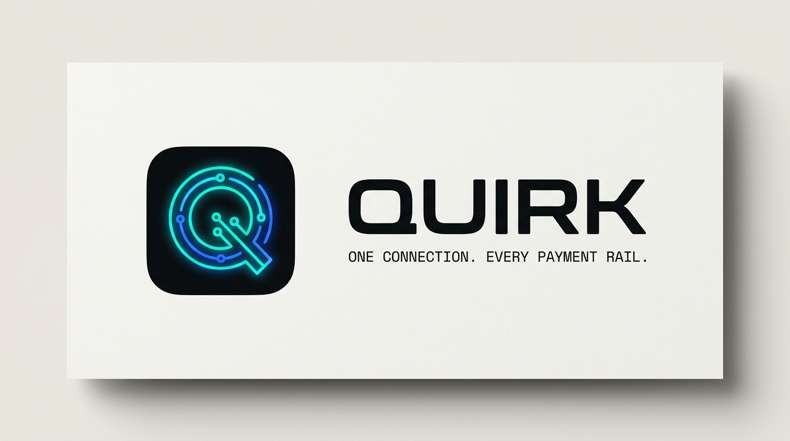

# DESIGN.md: Quirk Landing (Primora editorial *flow* × Quirk brand)

## Source
- **Flow / feel reference**: `https://primora.xyz/` — used **only** for structure, pacing, and editorial rhythm. None of Primora's literal styling (purple `#8827DD`, STK Bureau serif, dithered orange art, 0px‑radius buttons) is copied.
- **Brand source (source of truth)**: `QUIRK — Brand Identity` card — `apps/dashboard/public/images/quirk-brand-presentation.jpg`. A cyan→blue neon "routing‑Q" mark on a near‑black rounded tile, geometric wordmark, mono tagline "ONE CONNECTION. EVERY PAYMENT RAIL."
- **Capture date**: 2026-08-19
- **Evidence**: Firecrawl `branding,images` scrape (`.firecrawl/primora-branding.json`, `.firecrawl/primora-images.json`), page markdown for section order, and the in‑repo Quirk brand card.

## Reference


> **Rule of this build:** take Primora's *flow and feel* (confident editorial pacing, a giant hero over a line field, a partner marquee, an oversized impact‑stat band, a mission statement, a large footer wordmark) and render all of it in **Quirk's own brand** — dark, cyan→blue neon, soft‑rounded, harmonious. Nothing should contrast harshly.

---

## Design Summary
A **dark, editorial** landing that reads like a confident infrastructure brand. The page opens with a huge two‑line thesis over an animated **routing‑line mesh** (the brand's neon‑Q circuit motif abstracted to the page scale), then paces through Primora's rhythm — rail marquee → live product window → oversized stats → mission statement → capabilities → developer surface → checkout → pricing → FAQ → CTA → giant footer wordmark.

The **single signature** is the cyan→blue routing motif: the same neon lines that draw the brand's Q reappear as the hero/CTA background and as the live "Routing OS" window. That is where all boldness is spent; everything else stays quiet, low‑contrast, and disciplined.

### Non‑negotiables
- **No lime** (`#ABFF2A`) and **no purple/orange**. The brand is cyan + blue on dark. Lime is dropped everywhere on the landing (note: `theme.css` dark `--primary` is still lime for the dashboard — see Rerun notes).
- **No Space Grotesk.** Display is **Satoshi**; technical text is **JetBrains Mono**.
- Low contrast by design: near‑white text (`#F5F7FA`) on near‑black (`#080B10`), layered surfaces, hairline borders — never pure‑white on pure‑black.

---

## Design Tokens

### Colors
```css
/* Structure — layered dark (reused from Quirk dark theme) */
--bg:            #080B10;  /* page base */
--bg-alt:        #0B0E14;  /* alternating band / sidebars */
--surface:       #11161D;  /* cards, windows */
--surface-2:     #171D26;  /* elevated, inputs, hover */
--border:        #22303A;  /* hairline */
--border-strong: #2C3B47;  /* hover border */

/* Text */
--text:  #F5F7FA;  /* primary */
--muted: #A9B0BB;  /* secondary */
--dim:   #5D6875;  /* labels / captions */

/* Brand accent — the neon routing-Q */
--cyan:  #00D4FF;  /* primary accent */
--blue:  #2B6BFF;  /* secondary accent */
--grad:  linear-gradient(90deg, #00D4FF 0%, #2B6BFF 100%);  /* signature */

/* Semantic — ONLY inside the interactive failover simulator (they encode rail health) */
--warn:  #F5B83D;  /* degraded */
--down:  #EF4444;  /* outage */
--ok:    #00D4FF;  /* live / success — cyan, to stay on-brand (no green in palette) */
```

### Typography
- **Display H1**: Satoshi, 700, `clamp(2.75rem, 7vw, 6rem)`, tracking `-0.03em`, line‑height `0.98`.
- **H2**: Satoshi, 700, `clamp(1.75rem, 4vw, 3.25rem)`, tracking `-0.02em`.
- **H3 / card titles**: Satoshi, 600–700, `1.25–1.5rem`.
- **Body**: Inter, 400, `1rem–1.125rem`, line‑height `1.6`, color `--muted`.
- **Eyebrows / labels / data / code**: JetBrains Mono, uppercase, tracking `0.2em`, `0.7rem`, color `--cyan` or `--dim` — echoes the brand tagline lockup.

### Shape, spacing, motion
- **Radius**: buttons `rounded-full`; cards/windows `rounded-2xl`→`rounded-3xl`. Soft, matching the brand's rounded tile. No sharp 0px corners.
- **Section rhythm**: generous `py-24`/`py-28`; content max‑width `72rem`; editorial left‑aligned blocks at `max-w-4xl`.
- **Motion** (all `prefers-reduced-motion` guarded): infinite rail **marquee** (`.quirk-marquee-track`, pause on hover), routing‑line **flow** dashes (`.quirk-flow-line`), **node pulse** (`.quirk-node`), ambient **glow** (`.quirk-glow`). Buttons keep the global `active:scale-[0.97]`.

---

## Components
- **Nav**: floating frosted pill, `bg-[#080B10]/70 backdrop-blur-xl border-[#22303A] rounded-full`. Left: white QuirkLogo. Center: Routing OS · Rails · Developers · Checkout · Pricing. Right: `Sign In` + gradient `Get API keys`. `⌘K` command palette preserved. (No theme switch — the landing is a fixed dark brand surface.)
- **Buttons**: primary = `bg-gradient-to-r from-[#00D4FF] to-[#2B6BFF] text-[#080B10]` pill with soft cyan glow; secondary = `bg-[#11161D] border-[#22303A] text-[#F5F7FA]` pill, hover border `--border-strong`.
- **Hero**: eyebrow pill → giant two‑line H1 ("Every rail. / One connection." — *one connection* in gradient) → subhead → primary + ghost CTAs → mono install chip, all over the animated routing‑line mesh + top radial glow.
- **Rail marquee**: infinite mono scroll of the 8 rails with cyan node dots; seamless double track, pause on hover.
- **Routing OS window** (signature, interactive): dark macOS‑style window — titlebar traffic lights, scenario toggles (Baseline / Paystack Spike / Switch Down), left rail tree, center live packet grid, right telemetry inspector, real‑time decision log. Live/OK states in cyan; degraded amber, outage red only here.
- **Impact stats band**: 4 oversized Satoshi figures (rails · failover · 24h volume · success) with mono labels, on `--bg-alt` between hairline rules.
- **Mission statement**: one large editorial paragraph, `max-w-4xl`, with a single gradient accent phrase.
- **Capabilities bento**: 2‑2‑span cards on `--surface`, cyan icons, mono metric footers.
- **Developer surface**: dark multi‑language SDK terminal (Node/Go/Python/cURL tabs, response JSON, "Execute test charge").
- **Checkout preview**: dark drop‑in modal, currency switch (NGN/KES/USD), method select, virtual‑account copy, gradient pay button, cyan success.
- **Pricing**: two tiers — Developer on `--surface`; Scale/Enterprise on `--bg-alt` with a cyan‑bordered glow and gradient badge.
- **FAQ**: hairline accordion on `--surface`, hover title cyan.
- **CTA**: dark panel over routing‑line mesh, gradient primary button.
- **Footer**: link columns + operational status, over an **oversized ghost "QUIRK" wordmark** (`text-[#141A22]`) — Primora's big footer wordmark, in Quirk's tone.

## Page Patterns
Nav → Hero (mesh) → Rail marquee → Routing OS window → Impact stats → Mission → Capabilities → Developer SDK → Checkout → Pricing → FAQ → CTA → Footer wordmark. Fully responsive; mobile collapses grids to single column, marquee and mesh persist, nav becomes a sheet.

## Content Style
Confident, plain, engineer‑literate. Short editorial headlines; specific numbers (`<190ms`, `99.4%`, `₦48M+`). CTAs are literal actions ("Get API keys", "Execute test charge", "Copy"). No hype adjectives; the product's live behavior is the proof.

## Agent Build Instructions
1. Force dark: root `bg-[#080B10] text-[#F5F7FA] font-['Inter']`; headings `font-['Satoshi']`; technical `font-['JetBrains_Mono']`. Do not read theme — the page is always dark. Pass `lightMode={false}` to every `QuirkLogo` (renders the white mark).
2. Use the color tokens above as hardcoded Tailwind arbitrary hex classes (existing pattern). Never introduce lime/purple/orange.
3. Signature = the routing‑line mesh SVG (thin `--cyan`/`--blue` strokes, `.quirk-flow-line` + `.quirk-node`) in the hero and CTA backgrounds; keep it subtle (low opacity) so text stays dominant.
4. Preserve all React state and handlers verbatim (`commandPaletteOpen`, `simulatedScenario`, `selectedLang`/`terminalTab`/`handleSimulateCall`, checkout state, `openFaqIndex`). Only restyle and re‑order into the pattern above; add marquee, stats band, mission, footer wordmark.
5. Respect `prefers-reduced-motion` (handled in `index.css`). Keep visible focus and `active:scale` feedback.

## Rerun Inputs
```yaml
workflow: firecrawl-website-design-clone
source_url: https://primora.xyz/          # flow/feel only
brand_source: apps/dashboard/public/images/quirk-brand-presentation.jpg
target_brand: Quirk
target_aesthetic: dark editorial, cyan→blue neon routing motif, no lime
output: DESIGN.md
notes: theme.css dark --primary is still lime (#ABFF2A) for the dashboard; landing intentionally overrides to cyan/blue. Align dashboard theme separately if desired.
```
